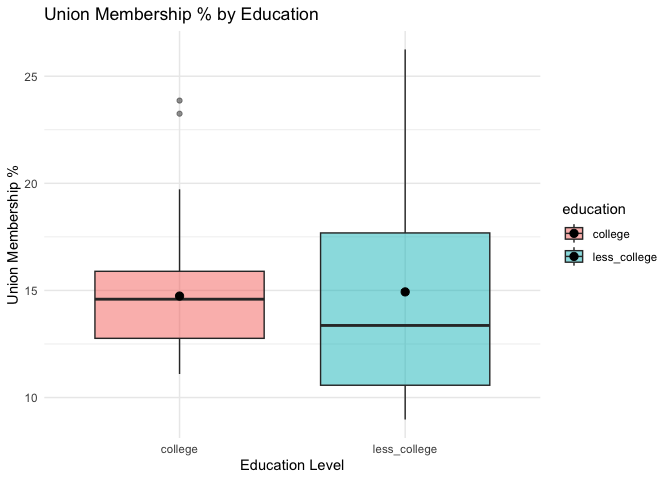
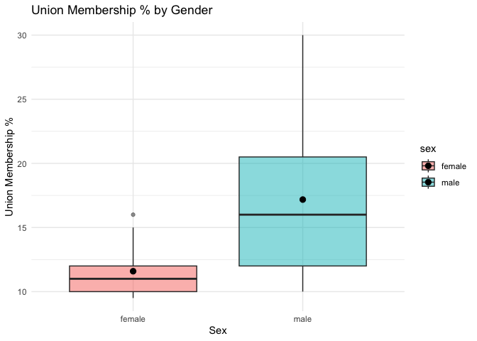
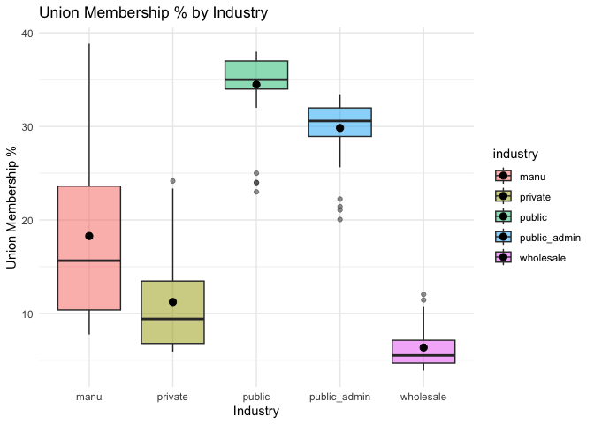
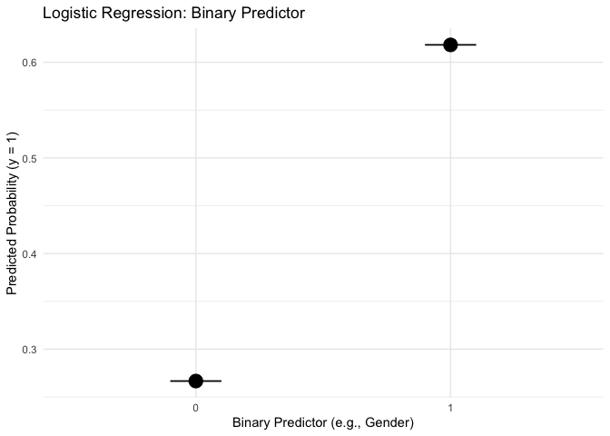
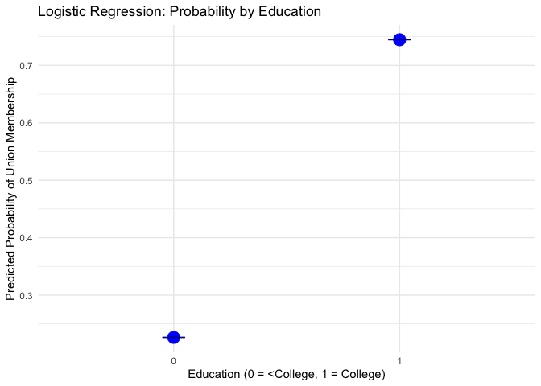

# EDA


## EDA

You can write text in here what you are about to present…

``` r
#load packages and read data
library(tidyverse)
```

    ── Attaching core tidyverse packages ──────────────────────── tidyverse 2.0.0 ──
    ✔ dplyr     1.1.4     ✔ readr     2.1.5
    ✔ forcats   1.0.0     ✔ stringr   1.5.1
    ✔ ggplot2   3.5.2     ✔ tibble    3.2.1
    ✔ lubridate 1.9.4     ✔ tidyr     1.3.1
    ✔ purrr     1.0.4     
    ── Conflicts ────────────────────────────────────────── tidyverse_conflicts() ──
    ✖ dplyr::filter() masks stats::filter()
    ✖ dplyr::lag()    masks stats::lag()
    ℹ Use the conflicted package (<http://conflicted.r-lib.org/>) to force all conflicts to become errors

``` r
education_data <- read_csv(file="../Project 1/Data/education_data.csv")
```

    Rows: 102 Columns: 8
    ── Column specification ────────────────────────────────────────────────────────
    Delimiter: ","
    chr (1): education
    dbl (7): year, sample_size, employment, members, covered, perc_mem, per_cove...

    ℹ Use `spec()` to retrieve the full column specification for this data.
    ℹ Specify the column types or set `show_col_types = FALSE` to quiet this message.

``` r
sex_data <- read_csv(file="../Project 1/Data/sex_data.csv")
```

    Rows: 102 Columns: 8
    ── Column specification ────────────────────────────────────────────────────────
    Delimiter: ","
    chr (1): sex
    dbl (7): year, sample_size, employment, members, covered, perc_mem, per_cove...

    ℹ Use `spec()` to retrieve the full column specification for this data.
    ℹ Specify the column types or set `show_col_types = FALSE` to quiet this message.

``` r
industry_data <- read_csv(file="../Project 1/Data/industry_data.csv")
```

    Rows: 255 Columns: 8
    ── Column specification ────────────────────────────────────────────────────────
    Delimiter: ","
    chr (1): industry
    dbl (7): year, sample_size, employment, members, covered, perc_mem, per_cove...

    ℹ Use `spec()` to retrieve the full column specification for this data.
    ℹ Specify the column types or set `show_col_types = FALSE` to quiet this message.

``` r
### Table for model with education

mod1<-lm(perc_mem~education, data=education_data)
summary(mod1)
```


    Call:
    lm(formula = perc_mem ~ education, data = education_data)

    Residuals:
        Min      1Q  Median      3Q     Max 
    -5.9572 -3.0029 -0.3629  1.3462 11.3200 

    Coefficients:
                          Estimate Std. Error t value Pr(>|t|)    
    (Intercept)            14.7372     0.5841  25.229   <2e-16 ***
    educationless_college   0.1941     0.8261   0.235    0.815    
    ---
    Signif. codes:  0 '***' 0.001 '**' 0.01 '*' 0.05 '.' 0.1 ' ' 1

    Residual standard error: 4.172 on 100 degrees of freedom
    Multiple R-squared:  0.000552,  Adjusted R-squared:  -0.009443 
    F-statistic: 0.05523 on 1 and 100 DF,  p-value: 0.8147

``` r
### Table for model with gender

mod2<-lm(perc_mem~sex, data=sex_data)
summary(mod2)
```


    Call:
    lm(formula = perc_mem ~ sex, data = sex_data)

    Residuals:
        Min      1Q  Median      3Q     Max 
    -7.1765 -2.0902 -0.5902  1.4098 12.8235 

    Coefficients:
                Estimate Std. Error t value Pr(>|t|)    
    (Intercept)  11.5902     0.6526  17.759  < 2e-16 ***
    sexmale       5.5863     0.9230   6.053  2.5e-08 ***
    ---
    Signif. codes:  0 '***' 0.001 '**' 0.01 '*' 0.05 '.' 0.1 ' ' 1

    Residual standard error: 4.661 on 100 degrees of freedom
    Multiple R-squared:  0.2681,    Adjusted R-squared:  0.2608 
    F-statistic: 36.63 on 1 and 100 DF,  p-value: 2.499e-08

``` r
### Table for model with industry

mod3<-lm(perc_mem~industry, data=industry_data)
summary(mod3)
```


    Call:
    lm(formula = perc_mem ~ industry, data = industry_data)

    Residuals:
         Min       1Q   Median       3Q      Max 
    -11.4706  -2.4706  -0.0625   2.2522  20.5646 

    Coefficients:
                         Estimate Std. Error t value Pr(>|t|)    
    (Intercept)           18.2846     0.7599  24.063  < 2e-16 ***
    industryprivate       -7.0534     1.0746  -6.564 3.01e-10 ***
    industrypublic        16.1860     1.0746  15.062  < 2e-16 ***
    industrypublic_admin  11.5537     1.0746  10.751  < 2e-16 ***
    industrywholesale    -11.9134     1.0746 -11.086  < 2e-16 ***
    ---
    Signif. codes:  0 '***' 0.001 '**' 0.01 '*' 0.05 '.' 0.1 ' ' 1

    Residual standard error: 5.427 on 250 degrees of freedom
    Multiple R-squared:  0.7984,    Adjusted R-squared:  0.7952 
    F-statistic: 247.6 on 4 and 250 DF,  p-value: < 2.2e-16

``` r
library(ggplot2)
library(dplyr)
library(Hmisc)  # for mean_cl_boot
```


    Attaching package: 'Hmisc'

    The following objects are masked from 'package:dplyr':

        src, summarize

    The following objects are masked from 'package:base':

        format.pval, units

``` r
# Table 1: Boxplot by Education
plot1 <- ggplot(education_data, aes(x = education, y = perc_mem, fill = education)) +
  geom_boxplot(alpha = 0.5) +
  stat_summary(fun = mean, geom = "point", shape = 20, size = 4, color = "black") +
  labs(title = "Union Membership % by Education",
       x = "Education Level", y = "Union Membership %") +
  theme_minimal()

ggsave("table1_education.png", plot = plot1, width = 6, height = 4, dpi = 300)
print(plot1)
```



``` r
# Table 2: Boxplot by Sex
plot2 <- ggplot(sex_data, aes(x = sex, y = perc_mem, fill = sex)) +
  geom_boxplot(alpha = 0.5) +
  stat_summary(fun = mean, geom = "point", shape = 20, size = 4, color = "black") +
  labs(title = "Union Membership % by Gender",
       x = "Sex", y = "Union Membership %") +
  theme_minimal()

ggsave("table2_sex.png", plot = plot2, width = 6, height = 4, dpi = 300)
print(plot2)
```



``` r
# Table 3: Boxplot by Industry 
plot3 <- ggplot(industry_data, aes(x = industry, y = perc_mem, fill = industry)) +
  geom_boxplot(alpha = 0.5) +
  stat_summary(fun = mean, geom = "point", shape = 20, size = 4, color = "black") +
  labs(title = "Union Membership % by Industry",
       x = "Industry", y = "Union Membership %") +
  theme_minimal()

ggsave("table3_industry.png", plot = plot3, width = 7, height = 4, dpi = 300)
print(plot3)
```



``` r
# Table 4: Logistic Regression (Simulated Binary Predictor) 
set.seed(42)
x <- rbinom(100, 1, 0.5)
prob <- 1 / (1 + exp(-(-1 + 2 * x)))
y <- rbinom(100, 1, prob)
df1 <- data.frame(x = x, y = y)
model1 <- glm(y ~ x, data = df1, family = binomial)
df1$predicted <- predict(model1, type = "response")

plot4 <- ggplot(df1, aes(x = factor(x), y = predicted)) +
  stat_summary(fun = mean, geom = "point", size = 5) +
  stat_summary(fun.data = mean_cl_boot, geom = "errorbar", width = 0.2) +
  labs(x = "Binary Predictor (e.g., Gender)", y = "Predicted Probability (y = 1)",
       title = "Logistic Regression: Binary Predictor") +
  theme_minimal()
print(plot4)
```



``` r
ggsave("table4_logistic_binary.png", plot = plot4, width = 6, height = 4, dpi = 300)

# Table 5: Logistic Regression by Education 
set.seed(123)
n <- 100
education <- rbinom(n, 1, 0.5)
prob_union <- 1 / (1 + exp(-( -1 + 2 * education )))  
union_member <- rbinom(n, 1, prob_union)
df2 <- data.frame(union_member, education)
model2 <- glm(union_member ~ education, data = df2, family = binomial)
df2$predicted_prob <- predict(model2, type = "response")

plot5 <- ggplot(df2, aes(x = factor(education), y = predicted_prob)) +
  stat_summary(fun = mean, geom = "point", size = 5, color = "blue") +
  stat_summary(fun.data = mean_cl_boot, geom = "errorbar", width = 0.1, color = "darkblue") +
  labs(
    x = "Education (0 = <College, 1 = College)",
    y = "Predicted Probability of Union Membership",
    title = "Logistic Regression: Probability by Education"
  ) +
  theme_minimal()

ggsave("table5_logistic_education.png", plot = plot5, width = 6, height = 4, dpi = 300)
print(plot5)
```


